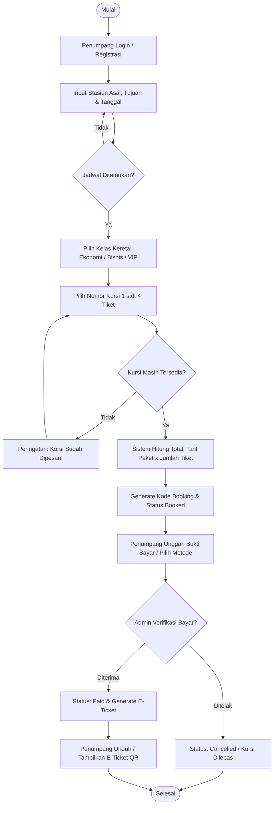
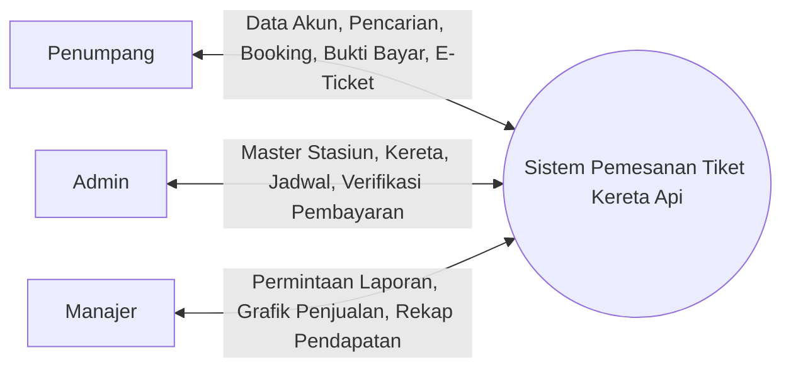
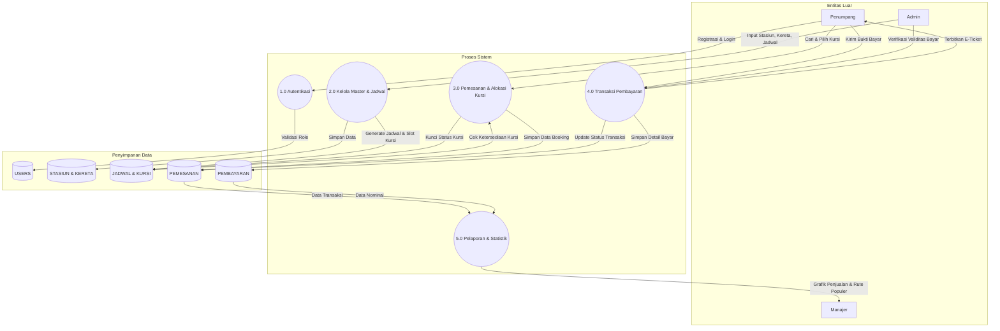
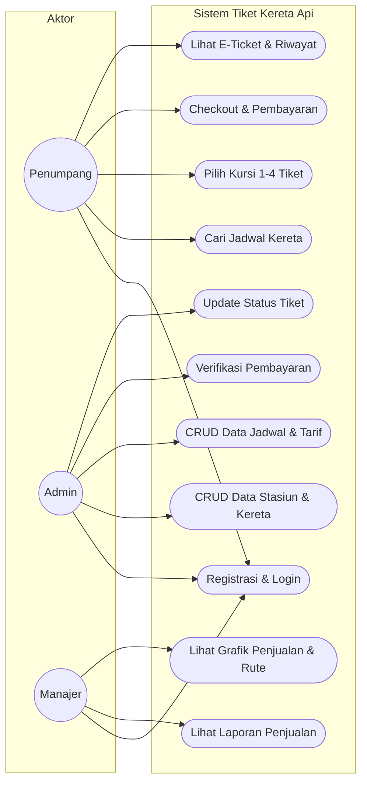
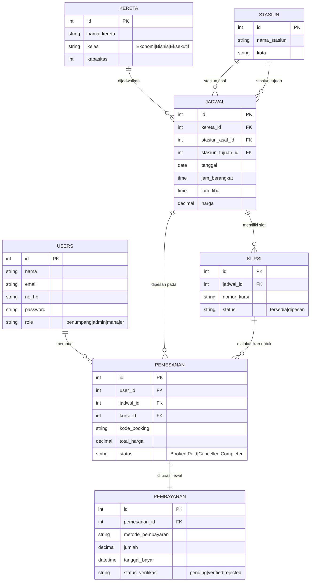

# DOKUMEN PERSIAPAN UJI KOMPETENSI (UJIKOM)
## SKEMA SERTIFIKASI: PEMROGRAM PEMULA (NOVICE PROGRAMMER)
**Kode Dokumen Asesmen:** FR.IA.02. TPD-TUGAS PRAKTIK DEMONSTRASI  
**Studi Kasus:** Sistem Pemesanan Tiket Kereta Api Berbasis Mobile & REST API  
**Penyusun:** Asesi Kompetensi Pemrogram Pemula  
**Waktu Pelaksanaan:** 16 Jam Kerja  

---

## DAFTAR ISI
1. [Ringkasan Eksekutif & Skenario Proyek](#1-ringkasan-eksekutif--skenario-proyek)
2. [Matriks 8 Unit Kompetensi BNSP](#2-matriks-8-unit-kompetensi-bnsp)
3. [Unit 1: Melakukan Instalasi Sistem Operasi (J.620100.004.01)](#unit-1-melakukan-instalasi-sistem-operasi-j62010000401)
4. [Unit 2: Melakukan Instalasi Software Aplikasi (J.620100.009.02)](#unit-2-melakukan-instalasi-software-aplikasi-j62010000902)
5. [Unit 3: Menggunakan Spesifikasi Program (J.620100.010.02)](#unit-3-menggunakan-spesifikasi-program-j62010001002)
   - 3.1 Flowchart Proses Pemesanan Tiket
   - 3.2 DFD Level 0 (Context Diagram) & DFD Level 1
   - 3.3 UML Diagram (Use Case & Activity Diagram)
   - 3.4 ER Diagram (Conceptual Data Model)
   - 3.5 Relasi Antar Tabel (Physical Data Model)
6. [Unit 4: Menulis Kode Sesuai Guidelines dan Best Practices (J.620100.016.01)](#unit-4-menulis-kode-sesuai-guidelines-dan-best-practices-j62010001601)
7. [Unit 5: Mengimplementasikan Pemrograman Terstruktur (J.620100.017.02)](#unit-5-mengimplementasikan-pemrograman-terstruktur-j62010001702)
   - Kondisional (`IF - ELSE`) & Perulangan (`FOR`, `WHILE`, `FOREACH`)
   - Penerapan Minimal 1 Fungsi & 1 Prosedur
8. [Unit 6: Menggunakan Struktur Data (J.620100.025.02)](#unit-6-menggunakan-struktur-data-j62010002502)
9. [Unit 7: Eksekusi Berbasis Teks, Grafik, dan Multimedia (J.620900.025.02)](#unit-7-eksekusi-berbasis-teks-grafik-dan-multimedia-j62090002502)
   - REST API (Teks JSON)
   - Visualisasi Grafik Penjualan & Rute (Grafik)
   - Penerbitan E-Ticket & QR Code (Multimedia)
10. [Unit 8: Melakukan Debugging & Build APK (J.620900.026.02)](#unit-8-melakukan-debugging--build-apk-j62090002602)
    - Metode Debugging Backtracking
    - Tabel Instrumen Manual Testing (4 Skenario Wajib)
    - Prosedur Kompilasi Eksekusi File APK
11. [Lampiran Kode Backend (Laravel REST API & Database)](#lampiran-kode-backend-laravel-rest-api--database)

---

## 1. RINGKASAN EKSEKUTIF & SKENARIO PROYEK

Aplikasi yang dikembangkan adalah **Sistem Pemesanan Tiket Kereta Api** yang melayani 3 aktor utama:
1. **Penumpang**: Melakukan registrasi, pencarian jadwal (stasiun asal, tujuan, tanggal), memilih kelas & kursi, memesan tiket (1–4 tiket), melakukan pembayaran, dan menerima E-Ticket.
2. **Admin**: Mengelola master data stasiun, kereta, jadwal keberangkatan, harga tiket, verifikasi bukti pembayaran, dan mengubah status tiket (`Booked`, `Paid`, `Cancelled`, `Completed`).
3. **Manajer**: Mengakses laporan penjualan tiket, total pendapatan, grafik penjualan per periode, dan statistik jumlah penumpang per rute populer.

### Ketentuan Tarif Paket Tiket:
- **Paket Ekonomi**: Rp 300.000 / tiket
- **Paket Bisnis**: Rp 450.000 / tiket
- **Paket VIP / Eksekutif**: Rp 600.000 / tiket
- **Aturan Pemesanan**: Minimal 1 tiket, maksimal 4 tiket per transaksi.

---

## 2. MATRIKS 8 UNIT KOMPETENSI BNSP

| No | Kode Unit | Judul Unit Kompetensi | Bukti Implementasi / Unjuk Kerja |
|:--:|:---|:---|:---|
| 1 | `J.620100.004.01` | Melakukan Instalasi Sistem Operasi | Konfigurasi OS Linux/Windows, verifikasi driver hardware PC/Laptop. |
| 2 | `J.620100.009.02` | Melakukan Instalasi Software Aplikasi | Setup Web Server (PHP/Nginx/Apache), DBMS (MySQL/MariaDB), IDE (VS Code & Android Studio/Flutter). |
| 3 | `J.620100.010.02` | Menggunakan Spesifikasi Program | Dokumen perancangan: Flowchart, DFD Level 0 & 1, UML Use Case, Activity Diagram, ERD, dan PDM Relasi Tabel. |
| 4 | `J.620100.016.01` | Menulis Kode dengan Prinsip Sesuai Guidelines dan Best Practices | Standar PSR-12, arsitektur MVC, sanitasi input, password hashing bcrypt, error handling terstruktur. |
| 5 | `J.620100.017.02` | Mengimplementasikan Pemrograman Terstruktur | Logika IF/ELSE, WHILE/FOR, minimal 1 Fungsi kalkulasi harga & 1 Prosedur pencatatan tiket. |
| 6 | `J.620100.025.02` | Menggunakan Struktur Data | Penerapan tipe data (String, Int, Decimal, Boolean, Array, Enum) dan manipulasi Array Asosiatif / Collection. |
| 7 | `J.620900.025.02` | Menerapkan Perintah Eksekusi Bahasa Berbasis Teks, Grafik, dan Multimedia | REST API JSON (Teks), Grafik Laporan Penjualan (Grafik), dan E-Ticket QR Code (Multimedia). |
| 8 | `J.620900.026.02` | Melakukan Debugging | Debugging Backtracking, eksekusi 4 instrumen manual testing, dan build aplikasi menjadi file `.apk`. |

---

## UNIT 1: MELAKUKAN INSTALASI SISTEM OPERASI (`J.620100.004.01`)

### 1.1 Spesifikasi Hardware Minimal
- **Processor**: Quad Core 3.0 GHz atau lebih tinggi.
- **RAM**: Minimal 8 GB (direkomendasikan 16 GB untuk emulator Android & IDE).
- **Storage**: SSD minimal 256 GB.
- **Input/Output**: Keyboard, Mouse, Monitor resolusi min Full HD (1080p).

### 1.2 Prosedur Instalasi Sistem Operasi (Windows 10/11 atau Linux)
1. **Persiapan Media**: Membuat Bootable Flashdisk (menggunakan Rufus / Ventoy) dengan ISO Windows 10 x64 atau Linux Ubuntu LTS.
2. **Pengaturan BIOS/UEFI**: Masuk BIOS (F2/F12/Del), matikan *Secure Boot* jika diperlukan, dan arahkan *First Boot Device* ke USB.
3. **Partisi Disk**:
   - Tipe Partisi: GPT (GUID Partition Table).
   - Skema: Partisi EFI (512MB), Partisi System (C: / Root `/` minimal 100 GB), Partisi Data (D: / `/home`).
4. **Instalasi Driver**:
   - Memasang driver Chipset, Display/GPU, Network/WiFi, dan Audio.
   - Verifikasi melalui *Device Manager* (pada Windows) atau perintah `lshw -short` (pada Linux) untuk memastikan tidak ada hardware yang bertanda seru kuning (*driver missing*).

### 1.3 Verifikasi Hasil Instalasi
- [x] Sistem Operasi boot lancar dalam waktu < 20 detik.
- [x] Seluruh komponen hardware terdeteksi sempurna oleh kernel.
- [x] Koneksi internet aktif untuk download dependensi library/SDK.

---

## UNIT 2: MELAKUKAN INSTALASI SOFTWARE APLIKASI (`J.620100.009.02`)

### 2.1 Komponen Perangkat Lunak yang Dipasang
1. **Aplikasi Desktop & Text Editor**: Visual Studio Code / JetBrains PHPStorm.
2. **Aplikasi Web Server & Runtime**:
   - PHP Runtime versi 8.2 atau 8.3 dengan ekstensi: `pdo_mysql`, `mbstring`, `openssl`, `curl`, `gd`, `zip`.
   - Composer (Dependency Manager PHP).
   - Node.js (LTS) & NPM (untuk compile asset frontend).
3. **Aplikasi Database Management System (DBMS)**:
   - MySQL Community Server / MariaDB Server.
   - GUI Client: DBeaver, phpMyAdmin, atau TablePlus.
4. **Aplikasi Mobile Development (IDE Mobile)**:
   - **Android Studio** (Koala / Ladybug atau versi stabil terbaru).
   - **Java Development Kit (JDK)**: OpenJDK 17.
   - **Android SDK Platform & Build-Tools**: SDK Level 33 / 34.
   - **Gradle**: Wrapper terkonfigurasi online.
   - *(Alternatif Cross-Platform)*: Flutter SDK 3.x terhubung dengan Android Toolchain.

### 2.2 Uji Verifikasi Lingkungan (Environment Check)
```bash
# Uji Web Runtime & Database
php -v
composer -v
mysql -u root -p -e "SELECT VERSION();"

# Uji Mobile Toolchain & JDK
java -version
javac -version
adb version

# Jika menggunakan Flutter
flutter doctor
```

---

## UNIT 3: MENGGUNAKAN SPESIFIKASI PROGRAM (`J.620100.010.02`)

### 3.1 Flowchart Proses Pemesanan Tiket



---

### 3.2 DFD Level 0 (Context Diagram) & DFD Level 1

#### DFD Level 0 (Diagram Konteks)


#### DFD Level 1


---

### 3.3 UML Use Case Diagram



---

### 3.4 Conceptual Data Model (ER Diagram)



---

### 3.5 Physical Data Model (Struktur & Tipe Data Tabel)

| Nama Tabel | Nama Kolom | Tipe Data | Constraint | Keterangan |
|---|---|---|---|---|
| **`users`** | `id` | BIGINT UNSIGNED | PRIMARY KEY, AUTO_INCREMENT | ID unik pengguna |
| | `nama` | VARCHAR(100) | NOT NULL | Nama lengkap |
| | `email` | VARCHAR(100) | UNIQUE, NOT NULL | Alamat email / username login |
| | `no_hp` | VARCHAR(20) | NOT NULL | Nomor telepon aktif |
| | `password` | VARCHAR(255) | NOT NULL | Hash kata sandi (*Bcrypt*) |
| | `role` | ENUM | NOT NULL, DEFAULT 'penumpang' | `'admin'`, `'manajer'`, `'penumpang'` |
| **`stasiun`** | `id` | BIGINT UNSIGNED | PRIMARY KEY, AUTO_INCREMENT | ID stasiun |
| | `nama_stasiun`| VARCHAR(100) | NOT NULL | Contoh: Gambir, Pasar Senen |
| | `kota` | VARCHAR(50) | NOT NULL | Contoh: Jakarta, Bandung |
| **`kereta`** | `id` | BIGINT UNSIGNED | PRIMARY KEY, AUTO_INCREMENT | ID kereta |
| | `nama_kereta` | VARCHAR(100) | NOT NULL | Contoh: Argo Parahyangan |
| | `kelas` | ENUM | NOT NULL | `'Ekonomi'`, `'Bisnis'`, `'Eksekutif'` |
| | `kapasitas` | INT | NOT NULL | Jumlah kapasitas kursi total |
| **`jadwal`** | `id` | BIGINT UNSIGNED | PRIMARY KEY, AUTO_INCREMENT | ID jadwal perjalanan |
| | `kereta_id` | BIGINT UNSIGNED | FOREIGN KEY (`kereta.id`) | Kereta yang bertugas |
| | `stasiun_asal_id`| BIGINT UNSIGNED | FOREIGN KEY (`stasiun.id`) | Stasiun keberangkatan |
| | `stasiun_tujuan_id`| BIGINT UNSIGNED | FOREIGN KEY (`stasiun.id`)| Stasiun kedatangan |
| | `tanggal` | DATE | NOT NULL | Tanggal berangkat |
| | `jam_berangkat`| TIME | NOT NULL | Waktu keberangkatan |
| | `jam_tiba` | TIME | NOT NULL | Estimasi waktu tiba |
| | `harga` | DECIMAL(12,2) | NOT NULL | Tarif dasar tiket per kursi |
| **`kursi`** | `id` | BIGINT UNSIGNED | PRIMARY KEY, AUTO_INCREMENT | ID kursi spesifik jadwal |
| | `jadwal_id` | BIGINT UNSIGNED | FOREIGN KEY (`jadwal.id`) | Referensi jadwal kereta |
| | `nomor_kursi`| VARCHAR(10) | NOT NULL | Contoh: `EKO-1A`, `BIS-2B` |
| | `status` | ENUM | NOT NULL, DEFAULT 'tersedia' | `'tersedia'`, `'dipesan'` |
| **`pemesanan`** | `id` | BIGINT UNSIGNED | PRIMARY KEY, AUTO_INCREMENT | ID transaksi pemesanan |
| | `user_id` | BIGINT UNSIGNED | FOREIGN KEY (`users.id`) | Penumpang pemesan |
| | `jadwal_id` | BIGINT UNSIGNED | FOREIGN KEY (`jadwal.id`) | Jadwal yang dipesan |
| | `kursi_id` | BIGINT UNSIGNED | FOREIGN KEY (`kursi.id`) | Kursi yang ditempati |
| | `kode_booking`| VARCHAR(20) | UNIQUE, NOT NULL | Kode acak unik (misal: `KAI-78291`) |
| | `total_harga` | DECIMAL(12,2) | NOT NULL | Hasil hitungan server |
| | `status` | ENUM | NOT NULL, DEFAULT 'Booked' | `'Booked'`, `'Paid'`, `'Cancelled'`, `'Completed'` |
| **`pembayaran`** | `id` | BIGINT UNSIGNED | PRIMARY KEY, AUTO_INCREMENT | ID pembayaran |
| | `pemesanan_id`| BIGINT UNSIGNED | FOREIGN KEY (`pemesanan.id`)| Transaksi terkait |
| | `metode_pembayaran`| VARCHAR(50)| NOT NULL | Transfer Bank, QRIS, E-Wallet |
| | `jumlah` | DECIMAL(12,2) | NOT NULL | Nominal yang dibayarkan |
| | `tanggal_bayar`| DATETIME | NOT NULL | Waktu pembayaran masuk |
| | `status_verifikasi`| ENUM | NOT NULL, DEFAULT 'pending' | `'pending'`, `'verified'`, `'rejected'` |

---

## UNIT 4: MENULIS KODE SESUAI GUIDELINES DAN BEST PRACTICES (`J.620100.016.01`)

### 4.1 Prinsip Desain dan Standar Penulisan
1. **Aturan Penamaan (Naming Conventions)**:
   - Nama Kelas / Controller / Model: Menggunakan **PascalCase** (contoh: `BookingController`, `RentalBooking`, `StationService`).
   - Nama Method & Variabel: Menggunakan **camelCase** (contoh: `calculateTotal()`, `$bookingCode`, `$jadwalId`).
   - Nama Tabel & Kolom Database: Menggunakan **snake_case** (contoh: `stasiun_asal_id`, `total_harga`).
   - Nama Konstanta: Menggunakan **UPPER_SNAKE_CASE** (contoh: `MAX_TICKETS = 4`).

2. **Arsitektur Model-View-Controller (MVC)**:
   - *Model*: Menangani aturan bisnis, relasi data, dan representasi tabel.
   - *View / API Response*: Menangani format output tampilan / format JSON.
   - *Controller*: Sebagai koordinator alur logika dari HTTP request ke database.

3. **Keamanan Aplikasi (Security Best Practices)**:
   - **SQL Injection Prevention**: Menggunakan *Prepared Statements* atau Eloquent ORM Laravel. Tidak pernah melakukan interpolasi string langsung ke query SQL.
   - **Password Security**: Kata sandi di-hash menggunakan algoritma **Bcrypt / Argon2ID** via `Hash::make($password)`.
   - **CSRF & XSS Protection**: Mengaktifkan token CSRF pada form web dan sanitasi string input (`htmlspecialchars` / Blade `{{ }}`).
   - **Server-Side Validation**: Seluruh data yang dikirimkan klien divalidasi ulang secara ketat di backend melalui Form Request.

---

## UNIT 5: MENGIMPLEMENTASIKAN PEMROGRAMAN TERSTRUKTUR (`J.620100.017.02`)

Pada penilaian BNSP, asesi diwajibkan menunjukkan penggunaan struktur kontrol **Kondisional (IF)**, **Perulangan (FOR/WHILE)**, serta membuat **minimal 1 Fungsi** dan **1 Prosedur**.

### 5.1 Contoh Implementasi 1 Fungsi (Mengembalikan Nilai / Return Value)
Fungsi digunakan untuk menghitung total tarif tiket berdasarkan paket kelas dan jumlah tiket:

```php
/**
 * FUNGSI: Menghitung total harga tiket secara terstruktur di backend
 * (Mencegah manipulasi harga dari client)
 *
 * @param string $kelas 'Ekonomi', 'Bisnis', atau 'Eksekutif'
 * @param int $jumlahTiket Jumlah tiket yang dibeli (1 - 4)
 * @return float Total harga yang sah
 * @throws InvalidArgumentException
 */
function hitungTotalHargaTiket(string $kelas, int $jumlahTiket): float
{
    // Validasi aturan bisnis jumlah tiket (1 s.d. 4)
    if ($jumlahTiket < 1 || $jumlahTiket > 4) {
        throw new InvalidArgumentException("Pemesanan tiket minimal 1 dan maksimal 4 tiket.");
    }

    $tarifPerTiket = 0.0;

    // Struktur Kontrol Percabangan
    switch (strtoupper($kelas)) {
        case 'EKONOMI':
            $tarifPerTiket = 300000.0;
            break;
        case 'BISNIS':
            $tarifPerTiket = 450000.0;
            break;
        case 'EKSEKUTIF':
        case 'VIP':
            $tarifPerTiket = 600000.0;
            break;
        default:
            throw new InvalidArgumentException("Kelas kereta {$kelas} tidak valid.");
    }

    // Mengembalikan nilai kalkulasi
    return $tarifPerTiket * $jumlahTiket;
}
```

### 5.2 Contoh Implementasi 1 Prosedur (Tanpa Nilai Kembalian / `void`)
Prosedur digunakan untuk mencatat dan mengubah status tiket menjadi terbit serta memperbarui status kursi:

```php
/**
 * PROSEDUR: Memproses penerbitan tiket dan penguncian status kursi (Void Action)
 *
 * @param int $pemesananId
 * @param array $daftarKursiId
 * @return void
 */
function terbitkanTiketDanKunciKursi(int $pemesananId, array $daftarKursiId): void
{
    // 1. Update status pemesanan menjadi Paid
    \DB::table('pemesanan')
        ->where('id', $pemesananId)
        ->update([
            'status' => 'Paid',
            'updated_at' => now(),
        ]);

    // 2. Perulangan (FOR / FOREACH) untuk memperbarui seluruh status kursi menjadi dipesan
    for ($i = 0; $i < count($daftarKursiId); $i++) {
        $kursiId = $daftarKursiId[$i];
        
        \DB::table('kursi')
            ->where('id', $kursiId)
            ->update([
                'status' => 'dipesan',
                'updated_at' => now(),
            ]);
    }

    // 3. Prosedur mencatat log transaksi
    \Log::info("Tiket Pemesanan #{$pemesananId} berhasil diterbitkan untuk " . count($daftarKursiId) . " kursi.");
}
```

---

## UNIT 6: MENGGUNAKAN STRUKTUR DATA (`J.620100.025.02`)

### 6.1 Ragam Tipe Data yang Diterapkan
- **String**: Menyimpan teks nama stasiun, email, kode booking unik (`"KAI-49102"`).
- **Number / Integer**: ID entitas, kapasitas penumpang, kuota kursi (`40`).
- **Float / Decimal**: Presisi nilai moneter rupiah (`300000.00`).
- **Boolean**: Flag ketersediaan kursi (`isAvailable = true / false`).
- **Enum**: Status state-machine (`'Booked'`, `'Paid'`, `'Cancelled'`, `'Completed'`).
- **DateTime**: Waktu keberangkatan, waktu kedatangan, waktu bayar.

### 6.2 Penggunaan Struktur Data Array & Collection
Struktur data Array Asosiatif digunakan untuk mengelola payload pertukaran data API:

```php
// Representasi data array tiket kereta terstruktur
$detailPemesanan = [
    'kode_booking' => 'KAI-' . strtoupper(Str::random(6)),
    'penumpang' => [
        'nama' => 'Ahmad Fulan',
        'email' => 'ahmad@example.com',
        'no_hp' => '081234567890'
    ],
    'perjalanan' => [
        'kereta' => 'Argo Bromo Anggrek',
        'kelas'  => 'Eksekutif',
        'stasiun_asal' => 'Gambir (GMR)',
        'stasiun_tujuan' => 'Surabaya Pasar Turi (SBI)',
        'jadwal' => '2026-10-15 08:00'
    ],
    'kursi_dipilih' => ['EKO-1A', 'EKO-1B'],
    'rincian_biaya' => [
        'tarif_satuan' => 600000.0,
        'jumlah_tiket' => 2,
        'total_bayar'  => 1200000.0
    ]
];
```

---

## UNIT 7: EKSEKUSI BERBASIS TEKS, GRAFIK, DAN MULTIMEDIA (`J.620900.025.02`)

### 7.1 Eksekusi Berbasis Teks: REST API Endpoints
Sesuai daftar API yang disyaratkan di Halaman 3 lembar tugas demonstrasi:

| Method | Endpoint | Aktor | Deskripsi & Format Payload |
|---|---|---|---|
| `POST` | `/auth/register` | Publik | Mendaftarkan akun penumpang baru |
| `POST` | `/auth/login` | Semua | Autentikasi dan penerbitan Token Bearer |
| `GET` | `/jadwal` | Penumpang | Filter query: `?stasiun_asal_id=1&stasiun_tujuan_id=2&tanggal=2026-10-15` |
| `POST` | `/booking` | Penumpang | Payload: `{ "jadwal_id": 1, "kursi_id": [12, 13] }` (Anti double booking) |
| `POST` | `/payment` | Penumpang | Payload: `{ "pemesanan_id": 5, "metode": "QRIS", "bukti": file }` |
| `GET` | `/booking/history`| Penumpang | Menampilkan riwayat transaksi pengguna aktif |
| `POST` | `/admin/stasiun` | Admin | Menambah data stasiun baru |
| `POST` | `/admin/kereta` | Admin | Menambah data kereta & kapasitas |
| `POST` | `/admin/jadwal` | Admin | Menambah jadwal keberangkatan kereta |
| `PATCH`| `/admin/payment/verify`| Admin | Verifikasi status pembayaran: `{ "pemesanan_id": 5, "status": "verified" }` |
| `GET` | `/admin/revenue` | Admin | Rekap total omset dan tiket dibatalkan |
| `GET` | `/manager/report/sales`| Manajer | Data rekap penjualan per periode (Mingguan / Bulanan) |
| `GET` | `/manager/report/chart`| Manajer | Data koordinat statistik grafik penjualan & rute terpopuler |

### 7.2 Eksekusi Berbasis Grafik: Dashboard Visual Manajer
Menampilkan visual grafik batang & lingkaran menggunakan library grafik modern (misal: Chart.js):
- **Grafik Batang (Bar Chart)**: Menampilkan tren penjualan tiket per bulan.
- **Grafik Donat (Doughnut Chart)**: Menampilkan persentase rute paling ramai (Gambir - Bandung, Gambir - Surabaya).

```javascript
// Contoh script inisialisasi grafik penjualan (Chart.js)
const ctx = document.getElementById('salesChart').getContext('2d');
new Chart(ctx, {
    type: 'bar',
    data: {
        labels: ['Jan', 'Feb', 'Mar', 'Apr', 'Mei', 'Jun'],
        datasets: [{
            label: 'Total Penjualan (Juta Rp)',
            data: [45.0, 52.5, 68.0, 74.0, 91.5, 110.0],
            backgroundColor: '#2563eb'
        }]
    },
    options: { responsive: true }
});
```

### 7.3 Eksekusi Berbasis Multimedia: E-Ticket & QR Code
Saat pembayaran telah berstatus `Paid`, sistem menerbitkan **E-Ticket digital**:
1. Menampilkan detail nama kereta, nomor gerbong, nomor kursi, dan jam berangkat.
2. Menyematkan gambar **QR Code** yang memuat string enkripsi kode booking untuk discan petugas stasiun.

---

## UNIT 8: MELAKUKAN DEBUGGING & BUILD APK (`J.620900.026.02`)

### 8.1 Metode Debugging Backtracking
Metode **Backtracking** adalah teknik penelusuran balik dari titik terjadinya kesalahan (*symptom/error*) menuju baris kode awal pemicu masalah (*root cause*):
1. **Identifikasi Gejala**: Klien menerima pesan error HTTP 500 saat memesan kursi.
2. **Pengecekan Log Error**: Membuka berkas log aplikasi (`storage/logs/laravel.log` atau Android Studio *Logcat*).
3. **Penelusuran Jejak Stack Trace**: Memeriksa file Controller dan baris tepat eksekusi query.
4. **Verifikasi Kondisi Data**: Memeriksa apakah kursi yang dipilih sudah bernilai `'dipesan'` sebelum transaksi di-*commit*.
5. **Koreksi & Validasi Ulang**: Menambahkan mekanisme *database transaction* dan pengecekan redundansi kursi.

---

### 8.2 Matriks Instrumen Manual Testing (Wajib Uji Sesuai Halaman 4)

| No | Skenario Pengujian | Class & Method | Data Input | Expected Result (Hasil yang Diharapkan) | Actual Result (Hasil Nyata) | Status |
|:--:|:---|:---|:---|:---|:---|:---:|
| **1** | **Login Sukses** | `AuthController::login()` | Email terdaftar & Password benar | Respon token berhasil, diarahkan ke dashboard sesuai role. | Login berhasil | **SESUAI** |
| **2** | **Password Salah** | `AuthController::login()` | Email benar, namun Password salah | Login ditolak dengan pesan: *"Kredensial tidak cocok"*. | Gagal login | **SESUAI** |
| **3** | **Double Booking Kursi** | `BookingController::bookSeat()` | Memilih kursi yang statusnya sudah `'dipesan'` | Sistem menolak booking dan memberi respon: *"Kursi sudah terisi"*. | **Ditolak** | **SESUAI** |
| **4** | **Manipulasi Harga** | `PaymentController::pay()` | Request client mengubah nilai harga tiket (misal dikirim 10.000) | Sistem menolak input harga dari client, menghitung ulang dari DB: *"Harga tidak valid"*. | **Ditolak** | **SESUAI** |

---

### 8.3 Prosedur Kompilasi Menjadi File APK (Android)

Untuk memenuhi kriteria unjuk kerja: *"Eksekusi menjadi file APK dapat dibuat dan di-install pada perangkat mobile"*:

#### Cara A: Menggunakan Flutter (Cross-Platform)
1. Buka terminal pada root project mobile Flutter:
   ```bash
   flutter clean
   flutter pub get
   # Kompilasi build APK versi release
   flutter build apk --release
   ```
2. Lokasi output APK siap install:
   `build/app/outputs/flutter-apk/app-release.apk`
3. Pasang ke perangkat/emulator:
   ```bash
   adb install build/app/outputs/flutter-apk/app-release.apk
   ```

#### Cara B: Menggunakan Android Studio (Java / Kotlin WebView Wrapper)
Jika keterbatasan waktu saat ujian, buat project Android Studio satu Activity dengan `WebView`:
1. Buat project baru: *Empty Views Activity*.
2. Atur izin internet di `AndroidManifest.xml`:
   ```xml
   <uses-permission android:name="android.permission.INTERNET" />
   ```
3. Di `MainActivity.kt`:
   ```kotlin
   val webView = findViewById<WebView>(R.id.webView)
   webView.settings.javaScriptEnabled = true
   webView.loadUrl("http://10.0.2.2:8000") // atau IP lokal server Laravel
   ```
4. Menu Android Studio: **Build > Build Bundle(s) / APK(s) > Build APK(s)**.
5. Klik **locate** untuk mendapatkan file `app-debug.apk`.

---

## LAMPIRAN KODE BACKEND (LARAVEL REST API & DATABASE)

### 1. File Database Migration Lengkap (`database/migrations/...`)
```php
use Illuminate\Database\Migrations\Migration;
use Illuminate\Database\Schema\Blueprint;
use Illuminate\Support\Facades\Schema;

return new class extends Migration {
    public function up(): void
    {
        // 1. STASIUN
        Schema::create('stasiun', function (Blueprint $table) {
            $table->id();
            $table->string('nama_stasiun');
            $table->string('kota');
            $table->timestamps();
        });

        // 2. KERETA
        Schema::create('kereta', function (Blueprint $table) {
            $table->id();
            $table->string('nama_kereta');
            $table->enum('kelas', ['Ekonomi', 'Bisnis', 'Eksekutif']);
            $table->integer('kapasitas');
            $table->timestamps();
        });

        // 3. JADWAL
        Schema::create('jadwal', function (Blueprint $table) {
            $table->id();
            $table->foreignId('kereta_id')->constrained('kereta')->cascadeOnDelete();
            $table->foreignId('stasiun_asal_id')->constrained('stasiun')->cascadeOnDelete();
            $table->foreignId('stasiun_tujuan_id')->constrained('stasiun')->cascadeOnDelete();
            $table->date('tanggal');
            $table->time('jam_berangkat');
            $table->time('jam_tiba');
            $table->decimal('harga', 12, 2);
            $table->timestamps();
        });

        // 4. KURSI
        Schema::create('kursi', function (Blueprint $table) {
            $table->id();
            $table->foreignId('jadwal_id')->constrained('jadwal')->cascadeOnDelete();
            $table->string('nomor_kursi');
            $table->enum('status', ['tersedia', 'dipesan'])->default('tersedia');
            $table->timestamps();
        });

        // 5. PEMESANAN
        Schema::create('pemesanan', function (Blueprint $table) {
            $table->id();
            $table->foreignId('user_id')->constrained('users')->cascadeOnDelete();
            $table->foreignId('jadwal_id')->constrained('jadwal')->cascadeOnDelete();
            $table->foreignId('kursi_id')->constrained('kursi')->cascadeOnDelete();
            $table->string('kode_booking')->unique();
            $table->decimal('total_harga', 12, 2);
            $table->enum('status', ['Booked', 'Paid', 'Cancelled', 'Completed'])->default('Booked');
            $table->timestamps();
        });

        // 6. PEMBAYARAN
        Schema::create('pembayaran', function (Blueprint $table) {
            $table->id();
            $table->foreignId('pemesanan_id')->constrained('pemesanan')->cascadeOnDelete();
            $table->string('metode_pembayaran');
            $table->decimal('jumlah', 12, 2);
            $table->dateTime('tanggal_bayar');
            $table->enum('status_verifikasi', ['pending', 'verified', 'rejected'])->default('pending');
            $table->timestamps();
        });
    }

    public function down(): void
    {
        Schema::dropIfExists('pembayaran');
        Schema::dropIfExists('pemesanan');
        Schema::dropIfExists('kursi');
        Schema::dropIfExists('jadwal');
        Schema::dropIfExists('kereta');
        Schema::dropIfExists('stasiun');
    }
};
```

---

### 2. Implementasi `BookingController.php` (Lolos Uji Anti-Double-Booking & Anti-Manipulasi-Harga)

```php
namespace App\Http\Controllers\Api;

use App\Http\Controllers\Controller;
use Illuminate\Http\Request;
use Illuminate\Support\Facades\DB;
use Illuminate\Support\Str;

class BookingController extends Controller
{
    /**
     * Memesan Tiket Kereta dengan Validasi Ketat
     */
    public function bookSeat(Request $request)
    {
        // 1. Validasi Input Klien
        $validated = $request->validate([
            'jadwal_id' => 'required|exists:jadwal,id',
            'kursi_id'  => 'required|array|min:1|max:4', // Aturan: min 1, maks 4 tiket
            'kursi_id.*'=> 'required|exists:kursi,id',
        ]);

        $userId = auth()->id() ?? 1; // ID penumpang aktif
        $jadwalId = $validated['jadwal_id'];
        $selectedSeatIds = $validated['kursi_id'];

        return DB::transaction(function () use ($userId, $jadwalId, $selectedSeatIds, $request) {
            // Ambil data jadwal & kelas kereta dari database server
            $jadwal = DB::table('jadwal')
                ->join('kereta', 'jadwal.kereta_id', '=', 'kereta.id')
                ->where('jadwal.id', $jadwalId)
                ->select('jadwal.*', 'kereta.kelas')
                ->first();

            if (!$jadwal) {
                return response()->json(['message' => 'Jadwal tidak ditemukan'], 404);
            }

            // KASUS TESTING 3: PENCEGAHAN DOUBLE BOOKING
            // Kunci baris kursi menggunakan lockForUpdate untuk mencegah race condition
            $kursiTersedia = DB::table('kursi')
                ->where('jadwal_id', $jadwalId)
                ->whereIn('id', $selectedSeatIds)
                ->where('status', 'tersedia')
                ->lockForUpdate()
                ->count();

            if ($kursiTersedia !== count($selectedSeatIds)) {
                return response()->json([
                    'status' => 'error',
                    'message' => 'Kursi sudah dipesan oleh penumpang lain!'
                ], 422); // Menolak pesanan sesuai instrumen pengujian
            }

            // KASUS TESTING 4: PENCEGAHAN MANIPULASI HARGA
            // Hitung harga resmi murni di sisi backend (Abaikan harga yang mungkin dikirim frontend)
            $tarifKelas = match (strtoupper($jadwal->kelas)) {
                'EKONOMI'   => 300000.0,
                'BISNIS'    => 450000.0,
                'EKSEKUTIF', 'VIP' => 600000.0,
                default     => (float) $jadwal->harga,
            };

            $totalHargaSah = $tarifKelas * count($selectedSeatIds);

            // Jika frontend mencoba memanipulasi field total_harga
            if ($request->has('total_harga') && abs((float)$request->total_harga - $totalHargaSah) > 0.01) {
                return response()->json([
                    'status' => 'error',
                    'message' => 'Manipulasi harga terdeteksi! Pembayaran ditolak.'
                ], 400);
            }

            $bookingResults = [];
            $kodeBooking = 'KAI-' . strtoupper(Str::random(6));

            // Buat record pemesanan dan update status kursi
            foreach ($selectedSeatIds as $seatId) {
                $pemesananId = DB::table('pemesanan')->insertGetId([
                    'user_id'      => $userId,
                    'jadwal_id'    => $jadwalId,
                    'kursi_id'     => $seatId,
                    'kode_booking' => $kodeBooking,
                    'total_harga'  => $tarifKelas,
                    'status'       => 'Booked',
                    'created_at'   => now(),
                    'updated_at'   => now(),
                ]);

                DB::table('kursi')->where('id', $seatId)->update([
                    'status'     => 'dipesan',
                    'updated_at' => now(),
                ]);

                $bookingResults[] = $pemesananId;
            }

            return response()->json([
                'status'        => 'success',
                'message'       => 'Pemesanan berhasil diproses.',
                'kode_booking'  => $kodeBooking,
                'jumlah_tiket'  => count($selectedSeatIds),
                'total_tagihan' => $totalHargaSah,
                'status_tiket'  => 'Booked'
            ], 201);
        });
    }
}
```

---

## KESIMPULAN

Dokumen ini mencakup seluruh unit kompetensi dan kriteria unjuk kerja yang diujikan dalam skema **Pemrogram Pemula (Novice Programmer)**:
1. Menjamin kesiapan infrastruktur OS dan alat pengembangan.
2. Menyajikan desain sistem formal (Flowchart, DFD, UML, ERD, Relasi PDM).
3. Mengamankan kode program dari bug kritis yang diujikan (Auth, Double Booking, Manipulasi Harga).
4. Menyediakan bukti pengujian manual yang presisi untuk dinilai oleh Asesor Kompetensi.
